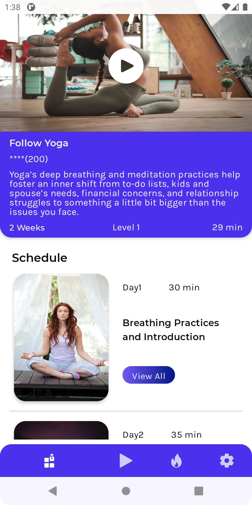
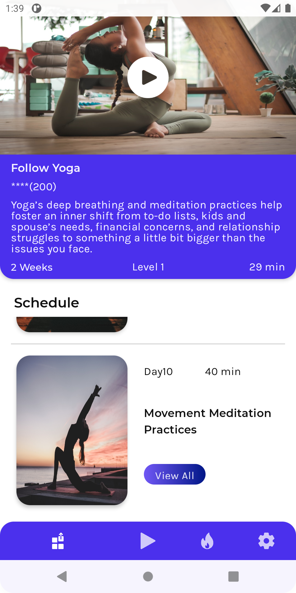
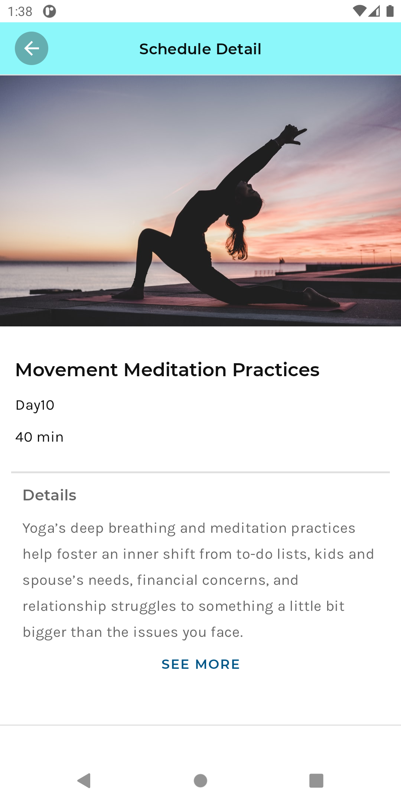
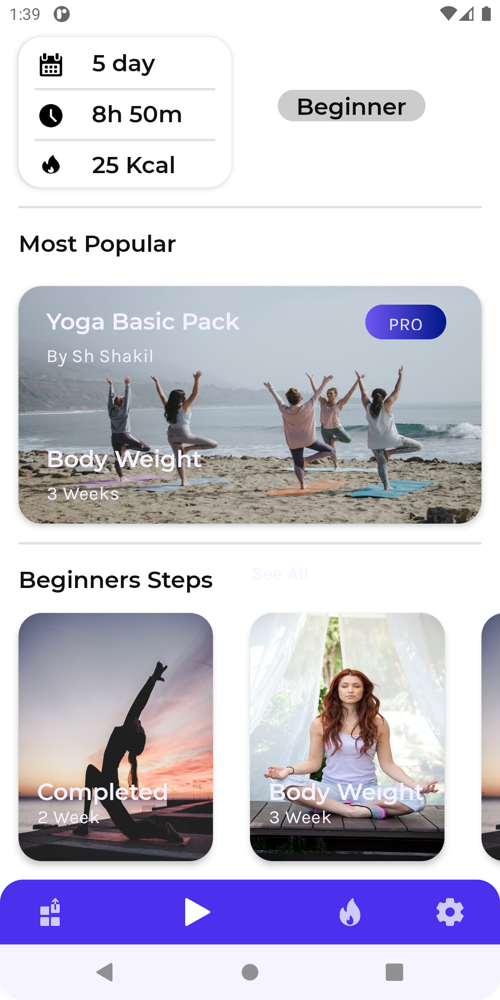
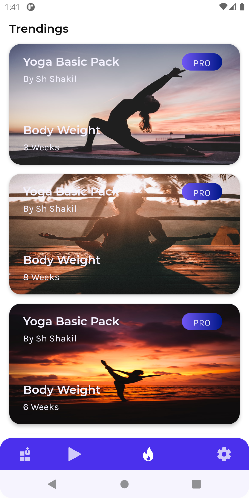
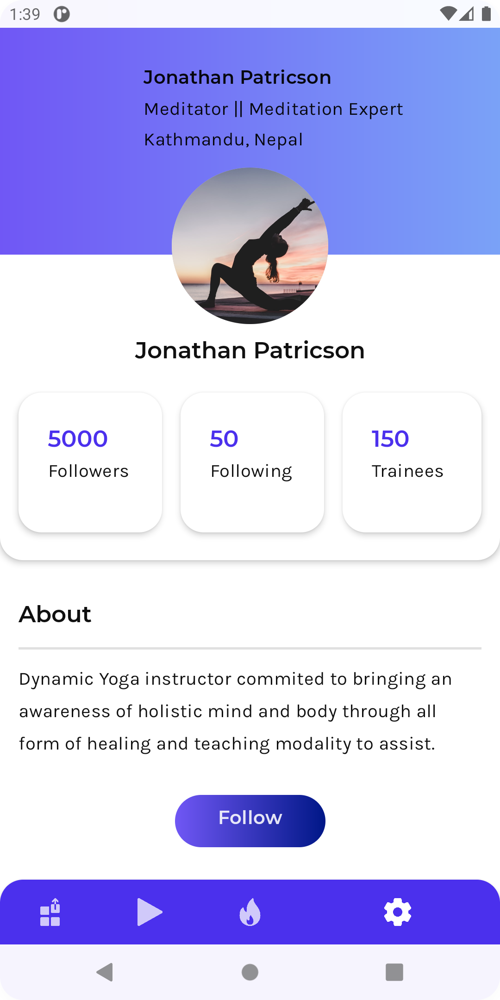

# JetComposeMeditationApp

This is a sample meditation android application that demonstrate the use of Jetpack Compose.

 ## -Requirements💻
To build this project, you need to use the latest version of [Android Studio Arctic Fox](https://developer.android.com/studio/preview).
You can clone this repository and build on this android studio version.

## - Modules
- App - It uses the all the components and class releated to the Android Framework. It gets the data from repo and shows on Compose-UI.
- BuildSrc - This module helps to list and manage all the dependencies of the app at one place. It has list of dependencies and versions of that dependencies. Helps for reusing the dependencies for multiple modules.

<b>Mockup Design from here:</b>

https://www.uplabs.com/posts/meditation-mobile-app-design-concept

## - Built With 🛠
- [Kotlin](https://kotlinlang.org/) - Programming language for Android development.
- [Jetpack Compose](https://developer.android.com/jetpack/compose) - Declarative way of building android UIs.
- [Android Studio](https://developer.android.com/studio) - Official android development IDE.

## - Jetpack Compose Components Used:
- Row
- Column
- LazyRow
- LazyColumn
- Box
- Spacer
- ConstraintLayout
- Compose Navigation
- Animation
- Custom Layout etc.

## - Screenshots:

</img>
</img>
</img>
</img>
</img>
</img>

